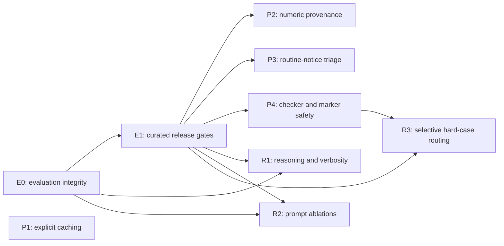

# Production editorial integration plan

## Status and authority

- **Status:** E0 landed on `main` on 2026-08-13 (this commit) and revalidated in
  the production checkout. Production packages and new scored evaluations remain
  subject to the gates below.
- **Plan date:** 2026-08-13.
- **Canonical evidence:** `prompts/production-editorial-ab-combined-report-2026-06-02_2026-08-13-final.md` from the source checkout at `C:\Users\WJX270\Documents\Kode\newsweb-explain-feed`.
- **Production baseline:** Regular prompt `v5.9.1` and the current mechanism-first production workflow.
- **Active next gate:** P1 code and E1 gate code are landed; P1 per-flow env
  flips proceed on their own calendar per `docs/prompt-caching.md`. The next
  implementation package is P2 numeric provenance in the two-phase shape of the
  2026-08-13 next-stage amendment below; E1 fixture seeding is its only external
  blocker (`RENDER_LOG_DATABASE_EXTERNAL_URL`).
- **Planning rule:** Where older evaluation notes conflict with the canonical final report, the final report governs findings and this plan governs sequencing.

This is a durable production-integration plan, not an execution log. `docs/editorial-eval.md` remains useful as operational and historical context, but it is not the decision record for prompt promotion.

## E0 implementation amendment — 2026-08-13

E0 is implemented in the evaluation-only path. The runner now uses explicit
prompt/schema/parser/validator profiles, independently seeded balanced placement
and presentation order, immutable version-3 artifacts, source/corpus/prompt/schema
hashes, stored review protocols, legacy non-promotion labeling, and side/category/
order integrity diagnostics. Existing review-interface and draft-prompt work was
preserved; no production default or publication path changed.

Validation completed:

- focused prompt and evaluation suites: 58 tests passed;
- full repository typecheck: passed;
- full repository test suite: 326 tests passed;
- the stored 50-case legacy run reports challenger placement 36/14, displayed-side
  preference 31/15, and `promotionEligible: false`.

No fresh OpenAI generation or scored A/B was run. The next action is protocol
review, followed by the existing decision on whether E1 should split deterministic
safety fixtures from human-scored editorial cases.

## E0 landing amendment — 2026-08-13

E0 was ported from the implementation worktree into the production checkout and
revalidated there: 58 focused tests, full typecheck, 326-test repository suite,
and a fresh legacy replay (`summary-v6draft-50-landed.json`) reproducing
challenger placement 36/14, displayed-side preference 31/15, and
`promotionEligible: false` with both non-promotion reasons.

Owner decisions recorded at landing:

- **E1 shape:** split — deterministic safety fixtures run as machine gates in CI;
  human-scored editorial cases live in a separate locked corpus consumed by the
  runner. Both under `apps/worker/src/fixtures/editorial-eval/`.
- **Process:** this is a single-owner system. Every "editorial/user approval"
  item in this plan means the owner reviews the diff or the summary; there are no
  sign-off ceremonies. Safety gates (unsupported numbers, checker fail-open,
  role-marker leaks) and one-behavior-change-per-release-window remain binding.
- **P1 amendment:** the installed `openai@7.4.0` SDK already types
  `prompt_cache_options` and per-content-part `prompt_cache_breakpoint`; no SDK
  upgrade is needed. Cache modes are `implicit` (today's bytes), `explicit`
  (breakpoint after the stable developer block), and `off` — where `off` must be
  expressed as `prompt_cache_options: {mode: "explicit"}` with zero breakpoints,
  because omitting `prompt_cache_key` does not disable implicit caching.
  Rollout order: PDF context `off`, reference check `off` (stable prefix below
  the cacheable minimum), regular rewrite `explicit`, then report/yearly;
  triage stays implicit.

## Next-stage amendment — 2026-08-13: P2 numeric provenance

Planned after the E1 landing. P1 and E1 code are on `main`; P1 env flips run on
their own calendar (`docs/prompt-caching.md`) and occupy their own release
windows. P2 development proceeds in parallel because its Phase A is shadow-only;
P2 enforcement flips never share a window with a cache flip.

**Single external blocker.** `RENDER_LOG_DATABASE_EXTERNAL_URL` in `.env` is an
empty placeholder. One owner action unblocks everything downstream: paste the
log-database external URL from the Render dashboard. Then, in one sitting:
`node scripts/clone-render-db.mjs` (local clones of both prod DBs), point
`GENERATION_LOG_DATABASE_URL` at the log clone, run
`npm run eval:editorial -w apps/worker -- build-safety-fixtures` (seeds all
seven safety classes; marker/loaded-language come from the legacy A/B artifact
automatically), review, commit. The same log clone is the P2 replay corpus —
no second data pull.

**Amended P2 shape.** `packages/prompt-kit/src/numbers.ts` already implements
eight implicit acceptance rules (exact match, thousands-separator equivalent,
clock time, shared percent range, explicit-thousands scale, scaled unit
million/billion, trade-arithmetic pair, trade-arithmetic aggregate). The
planned "structured assessment" is a refactor of that engine, not a parallel
system.

*Phase A — assessment engine, no behavior change (not blocked; starts now):*

1. Refactor `findUnexpectedNumbers` into an assessment function returning one
   record per rewrite number: display, span, disposition
   (`matched | derived | unexpected`), rule ID, and provenance (source span or
   operands, rule parameters, tolerance). The existing eight paths become named
   rules; `findUnexpectedNumbers` stays as a thin wrapper over
   `disposition === "unexpected"`.
2. Behavior-identity gate: all existing numbers/validation tests pass unchanged;
   once fixtures are seeded, `safety-gates.test.ts` replay shows zero drift.
3. Persist assessments in the validation detail the worker already stores
   (`validation_json` / `generation_runs.input_json`) on every call — this is
   the shadow telemetry, on from the day Phase A deploys. Export disposition
   counts by rule ID in `scripts/pull-signals.mjs` / `apps/web/lib/admin-signals.ts`.

*Phase B — corpus-driven acceptance rules (needs the log clone):*

4. Replay harness: run all 135 production `UNEXPECTED_NUMBERS` rows from the
   clone through the assessment engine; report per-case dispositions and which
   candidate rule would clear each false block. Targets: the 128 later-supported
   rows; the seven unresolved cases must stay `unexpected` (the safety gate
   enforces this permanently).
5. Implement only rule classes the replay actually demands, in the whitelist
   order already approved (scale/normalization, simple sums/differences,
   ratio/percent change, weighted-average price). No speculative rules. Each
   new rule: narrow trigger, full provenance, unit tests taken from real corpus
   cases, own entry in the enablement switch.
6. Config: `NUMERIC_ACCEPTANCE_RULES` (comma-separated list of enabled new-rule
   IDs; legacy rules are unconditionally on because they are today's behavior)
   in `apps/worker/src/config.ts`, `.env.example`, `render.yaml`. Default empty
   = shadow only.
7. Audit = owner reviews the replay diff (every newly accepted case, all seven
   unresolved still blocked). No other ceremony.

*Rollout:* deploy Phase A (shadow) → a few days of live shadow dispositions via
`signals:pull` → enable one rule class per release window by env flip, never in
a window with a cache flip → after each flip, re-run
`build-safety-fixtures --update-expected` and commit; that diff is the release
record. Rollback per rule class = remove it from the env list.

*Deferred decisions:* the `omtrent`/approximate-wording policy is decided only
when a rounding rule class actually surfaces in the replay, not up front. P4 is
the package after P2; its fixture classes (checker-error, marker leak) arrive in
the same seeding run, so it starts unblocked.

*Status 2026-08-13:* Phase A implemented and landed on `main` — assessment
engine in `numbers.ts` (named rules, provenance, `assessNumbers` /
`unexpectedNumberDisplays`), `numberAssessments` persisted in
`validation_json` across all three rewrite flows, and
`numericAssessmentsByPromptVersion` in the signals pull. Zero behavior change
verified by unchanged test suites plus a byte-identical replay of all 100
stored legacy-artifact generations. The same session found and fixed a P1
telemetry defect: the admin-signals export dropped
`promptCacheMode`/`promptCacheKey` from `model_calls`, which would have made
the cache rollout gates unverifiable in production.

## Outcome

Integrate the verified production findings into Autoweb without using the confounded A/B comparison as promotion evidence. Repair evaluation integrity first, then introduce production safety and efficiency changes behind shadowable controls, and keep prompt/model experiments isolated until they can be evaluated one variable at a time.

The intended end state is:

1. Reproducible, immutable editorial evaluations with balanced side assignment, correct prompt/schema pairing, randomized case order, and sufficient artifact metadata.
2. Curated regression sets that gate number handling, routine-notice triage, checker behavior, role-marker leakage, and editorial quality.
3. Independently releasable production improvements for explicit caching, numeric provenance, routine-notice handling, and checker/role-marker safety.
4. A separate research track for reasoning effort, verbosity, prompt ablations, `regular_v6_draft_2`, and selective hard-case routing.

## Evidence classification

### Verified production findings

These observations come from stored production behavior during 2026-06-02 through 2026-08-13 and may be used to prioritize production fixes:

- 4,229 generation rows, including 4,218 rewrite rows across 4,062 unique message IDs.
- 181 failed rows across 144 unique messages; 180 failures were deterministic blocks.
- `UNEXPECTED_NUMBERS` accounted for 135 failed rows. Of those, 128 later ended with 100% reference coverage and no unsupported references, indicating substantial numeric-validation overblocking while leaving seven cases that still require conservative treatment.
- Nine of sixteen explicit feedback submissions described the item as not news. Every one was classified `importance: uviktig` and was nevertheless published.
- Sixteen manual regenerations followed skipped results. Fifteen later published and one failed, demonstrating that skipped-result handling also has false positives.
- Eleven checker errors occurred; ten outputs were published. Four published outputs retained unsupported references: message IDs `679311`, `677571`, `677082`, and `675348`.
- Stored output for message `675713` leaked a role/reasoning marker. Stored output for `675772` used loaded `giftpille` wording.

These findings justify work on numeric provenance, class-specific routine-notice triage, checker fail-safe behavior, and role-marker validation. They do not by themselves justify a new prompt.

### Confounded A/B evidence

The 50-case editorial A/B run cannot support a prompt-promotion decision:

- The result was 25 control wins, 21 challenger wins, and 4 both-bad cases.
- The first 20 challenger outputs all appeared on side A.
- Reviewers preferred side B in 31 of 46 decided cases.
- The challenger appeared on side A 36 times and side B 14 times.
- The challenger was designed for the v6 response schema, while the runner used the v5 title-first schema.
- Category blocks and case ordering were fixed and noisy.
- A single reviewer supplied the judgments.

The stored outputs can still identify concrete failure examples and generate hypotheses, including shorter challenger outputs and fewer quote opportunities. Those observations must be re-tested after E0 and cannot be attributed causally to the prompt.

## Decisions already implied by the evidence

- Keep the current `v5.9.1` mechanism-first prompt in production while this plan is executed.
- Treat `regular_v6_draft` as rejected for promotion and retain it only when reproduction history is useful.
- Treat `regular_v6_draft_2` as an untested research design. It must not enter production before correct-schema evaluation and the promotion gates below.
- Do not run another promotion A/B until E0 is complete.
- Do not combine prompt, model, reasoning-effort, verbosity, routing, caching, or safety-policy changes in one causal comparison.
- Keep research artifacts and feature flags distinct from production defaults.
- Require editorial approval for publication-policy changes and final prompt/model promotion.

## Program invariants

1. **One independent variable per comparison.** Hold corpus, schema, model snapshot, reasoning effort, verbosity, tool configuration, and reviewer protocol constant unless that item is the declared variable.
2. **Correct prompt/schema pairing.** Every prompt profile declares its output schema, parser, and validation profile; the runner refuses incompatible combinations.
3. **Immutable artifacts.** A saved evaluation contains outputs, assignments, presentation order, configuration, source revision, and hashes needed to reproduce the review surface.
4. **Safety before style.** No style or brevity win can offset a regression in unsupported claims, financing/dilution facts, numeric integrity, stage accuracy, or role-marker leakage.
5. **Shadow before enforcement.** New production decisions run without changing publication behavior until their false-positive and false-negative rates are reviewed.
6. **Class-specific automation.** `uviktig` is a useful signal, not a blanket reason to suppress an item.
7. **Conservative uncertainty.** Uncertain numeric and newsworthiness cases remain visible or blocked according to the existing safer behavior until evidence supports a narrower rule.
8. **Editorial release authority.** Editors approve suppression classes, curated labels, acceptable tradeoffs, and prompt/model promotion.

## Repository integration map

The paths below are likely implementation seams identified by repository inspection. They are targets for later work, not edits made by this plan.

| Area | Likely code and documentation seams | Intended responsibility |
| --- | --- | --- |
| Evaluation runner and artifact | `apps/worker/src/scripts/editorial-eval.ts` | Canonical run profiles, stored configuration and assignments, review rendering, artifact schema/versioning, summary diagnostics |
| Evaluation selection and assignment | `apps/worker/src/services/editorial-eval.ts`, `apps/worker/src/services/editorial-eval.test.ts` | Seeded balanced assignment, randomized ordering, corpus selection, side/order metrics |
| Prompt/profile registry | `packages/prompt-kit/src/regular-prompt-variants.ts`, `packages/prompt-kit/src/prompt.ts`, `packages/prompt-kit/src/prompt-v6.test.ts`, `packages/prompt-kit/src/prompt.test.ts` | Prompt identity, production baseline, schema/profile declarations, prompt invariants |
| Response schemas | `packages/shared/src/rewrite.ts` | v5/v6 schema identity and compatibility assertions |
| Numeric validation | `packages/prompt-kit/src/numbers.ts`, `apps/worker/src/services/rewrite-validation.ts`, their tests, and `apps/worker/src/worker.ts` | Structured numeric provenance, deterministic derivations, warning policy, stored validation detail |
| Newsworthiness | `apps/worker/src/services/newsworthiness-triage.ts`, `apps/worker/src/services/importance.ts`, `apps/worker/src/worker.ts`, and their tests | Class-specific routine-notice decisions, separation of importance from publication action, shadow/enforce modes |
| Reference/checker safety | `apps/worker/src/services/reference-check.ts`, `apps/worker/src/services/rewrite-validation.ts`, `apps/worker/src/worker.ts`, and their tests | Checker-error outcome, last valid coverage, unsupported-reference blocking, role-marker rejection |
| OpenAI request controls | `packages/shared/src/openai-responses.ts`, `apps/worker/src/services/openai-responses.test.ts`, `apps/worker/src/worker.ts` | Explicit prompt caching, cache breakpoints, request metadata, verbosity and reasoning experiment controls |
| Model routing | `apps/worker/src/services/openai-model-routing.ts`, `apps/worker/src/services/openai-model-routing.test.ts`, `apps/worker/src/config.ts`, `.env.example`, `render.yaml` | Shadow hard-case classification, bounded escalation, independent configuration |
| Monitoring and export | `apps/web/lib/admin-signals.ts`, `scripts/pull-signals.mjs`, associated signal tests | Release cohorts, cache/latency/cost, block and publication outcomes, safety and quality rates |
| Evaluation documentation | `docs/editorial-eval.md` | Operational instructions after the implementation stabilizes; not the promotion decision record |

The current worktree already contains uncommitted user-owned edits in several evaluation and prompt-variant files. A later implementation session must inspect and reconcile those changes before modifying overlapping areas; it must not assume they belong to E0 or replace them.

## Dependency order



P1 may be implemented after E0 independently of P2–P4, but it must have its own rollout cohort and must not share an evaluation or production release window with another behavior change.

## Work packages

### E0 — Evaluation integrity

**Classification:** Evaluation infrastructure; no production editorial behavior change.

**Goal:** Make the next comparison reproducible and causally interpretable.

**Dependencies:** None. This is the first implementation package.

**Scope:**

- Define canonical evaluation profiles that bind variant ID, prompt version/hash, response schema ID, parser/validator profile, model snapshot, reasoning effort, verbosity, and relevant request settings.
- Fail before generation when a variant is paired with an incompatible schema.
- Replace incidental side placement with a seeded algorithm that produces exact or at-most-one-difference A/B balance for the selected case count.
- Generate a separate seeded case presentation order. Do not sort the review surface back into case-ID or category order.
- Generate assignments and order once per run, store them in the artifact, and render review HTML from the stored values. Reopening an artifact must not regenerate either value.
- Version the run artifact and store at least: run ID, UTC timestamps, source revision, dirty-worktree indicator, corpus ID/hash, case IDs and source hashes, variant/profile definitions, generation seed, ordering seed, assignments, presentation positions, generation errors, model/request metadata, and prompt/schema hashes.
- Add summary diagnostics for challenger-side counts, preference-by-side, category-by-side, order bands, missing reviews, and output-generation failures.
- Preserve read compatibility for existing artifacts where practical, but label legacy runs as non-promotable when required metadata is absent.

**Likely write scope:**

- `apps/worker/src/scripts/editorial-eval.ts`
- `apps/worker/src/services/editorial-eval.ts`
- `apps/worker/src/services/editorial-eval.test.ts`
- `packages/prompt-kit/src/regular-prompt-variants.ts`
- `packages/shared/src/rewrite.ts`
- Focused prompt-variant and schema tests
- `docs/editorial-eval.md` only after behavior is final

**Validation and exit criteria:**

- Assignment tests cover even and odd case counts, multiple seeds, exact balance bounds, determinism, and different-seed variation.
- Ordering tests prove deterministic replay, variation across seeds, and independence from case ID/category sorting.
- Each registered variant resolves exactly one compatible schema/parser profile; mismatches fail before an API call.
- A save/load/render round trip preserves byte-equivalent assignments and presentation positions.
- Artifacts expose enough metadata to reproduce the review surface and identify code/prompt/schema versions.
- The summary makes the known 36/14 side imbalance and side-B preference pattern discoverable when run against the legacy artifact.
- No production request path or default prompt changes.

**Decision point:** Approve the artifact format and assignment/order protocol before creating new scored evidence.

### E1 — Curated release gates

**Classification:** Evaluation infrastructure and editorial governance.

**Goal:** Turn the production findings into stable regression coverage and a representative promotion set.

**Dependencies:** E0.

**Scope:**

- Establish versioned fixture corpora, likely under `apps/worker/src/fixtures/editorial-eval/`, with source snapshots, immutable case IDs/hashes, labels, provenance, and inclusion rationale.
- Split deterministic safety fixtures from semantic/editorial review cases.
- Seed deterministic fixtures with:
  - representative `UNEXPECTED_NUMBERS` false positives plus all unresolved/unsafe numeric cases;
  - checker-error publications, especially `679311`, `677571`, `677082`, and `675348`;
  - role-marker leak `675713`;
  - loaded-language example `675772`;
  - routine notices editors considered not news;
  - false-skip/manual-regeneration examples;
  - financing/dilution, listing-stage, quote, neutrality, and angle-retention hard cases.
- Balance the semantic set across category, length, language, document complexity, stage, and known failure mode. Keep a small locked release set separate from an exploratory set.
- Document label definitions and adjudication. Record editor identity/version without exposing it in blind review.
- Add machine gates for deterministic checks and a stable scoring rubric for human review.

**Likely write scope:**

- New versioned fixture directories under `apps/worker/src/fixtures/editorial-eval/`
- `apps/worker/src/services/editorial-eval.ts` and tests
- `apps/worker/src/scripts/editorial-eval.ts`
- `docs/editorial-eval.md`

**Validation and exit criteria:**

- Fixtures validate schema, uniqueness, source hashes, and required labels in CI.
- The release set includes every confirmed safety failure class from the final report.
- Editors approve case inclusion, labels, rubric, and how disagreements are resolved.
- Reviewers can remain blind to variant identity and side assignment.
- A fresh baseline run on `v5.9.1` establishes expected variance and gate thresholds.

### P1 — Explicit prompt caching

**Classification:** Production operational improvement; intended to preserve editorial output.

**Goal:** Reduce repeated input cost and latency with explicit, observable caching.

**Dependencies:** E0 for configuration identity and reproducible validation. E1 is desirable but not required if output equivalence is checked on a fixed corpus.

**Scope:**

- Extend the shared Responses request wrapper to represent explicit cache mode and a cache breakpoint instead of relying only on `prompt_cache_key`.
- Use structured `input_text` content blocks where a breakpoint is needed.
- Place the breakpoint after the stable prefix and before per-message content. Do not include mutable source text in the stable cache identity.
- Introduce caching by flow, one at a time: PDF/reference context, regular rewrite, then report/yearly flows. Keep triage/review separate unless their prefix reuse is measured.
- Record cache mode, cache key/profile, cached input tokens, cache-write tokens, latency, errors, and model/request identity in existing model-call telemetry.
- Keep an immediate configuration switch to disable explicit caching without reverting code.

**Likely write scope:**

- `packages/shared/src/openai-responses.ts`
- `apps/worker/src/services/openai-responses.test.ts`
- `apps/worker/src/worker.ts`
- `apps/worker/src/config.ts`, `.env.example`, `render.yaml`
- `apps/web/lib/admin-signals.ts`, `scripts/pull-signals.mjs`, signal tests

**Gates and rollout:**

1. Unit-test request shape and breakpoint placement.
2. Prove output equivalence on a fixed corpus with caching off versus explicit mode.
3. Enable shadow telemetry for one flow.
4. Enable for a small production cohort, then one flow at a time.
5. Roll back to off if error rate rises by more than 0.5 percentage points, p90 latency rises by more than 10%, input cost rises by more than 5%, or any output/config mismatch appears.

### P2 — Number validation and provenance

**Classification:** Production correctness and false-block reduction.

**Goal:** Accept safely normalized or deterministically derived figures while retaining conservative blocking for unsupported numbers.

**Dependencies:** E1 numeric corpus. E0 if compared through the editorial runner.

**Scope:**

- Replace the binary unexpected-number result with structured assessments per output number:
  - exact source match;
  - normalized source match, including scale, separators, percent forms, currency representation, and sign conventions;
  - deterministically derived value;
  - ambiguous or unsupported value.
- Attach provenance: source span/value, normalization or derivation rule ID, operands, result, tolerance/rounding, and final disposition.
- Start with a narrow whitelist of operations supported by existing production examples: unit scaling, percentage/percentage-point normalization, simple sums/differences, ratios or percentage changes, and weighted average price where all inputs are explicit.
- Never infer a missing operand, currency conversion, period, sign, or denominator.
- Persist structured assessments in `validation_json` so the first release does not require a database migration.
- Separate validator confidence from publication policy. Unsupported or ambiguous output remains blocked; recognized safe derivations may pass.
- Replay all 135 production `UNEXPECTED_NUMBERS` rows. Target the 128 later-supported rows for explainable acceptance while preserving conservative outcomes for the seven unresolved cases.

**Likely write scope:**

- `packages/prompt-kit/src/numbers.ts` and focused tests
- `apps/worker/src/services/rewrite-validation.ts` and tests
- `apps/worker/src/worker.ts`
- `scripts/pull-signals.mjs` and signal tests

**Gates and rollout:**

1. Offline replay only; manually audit every newly accepted derivation rule.
2. Shadow structured decisions while the legacy blocker remains authoritative.
3. Enable one rule class at a time.
4. Require zero unsafe false negatives in the curated set and reviewed shadow sample.
5. Disable the new rule class immediately on any confirmed unsafe acceptance; retain provenance records for diagnosis.

**Editorial/user decision:** Approve allowed derivation classes, tolerances, and whether approximate values require visible wording such as `omtrent`.

### P3 — Routine `uviktig` triage and publication policy

**Classification:** Production editorial-policy change.

**Goal:** Suppress confirmed routine notices that are not news without turning `uviktig` into a blanket skip and without increasing false skips.

**Dependencies:** E1 routine-notice and false-skip corpus.

**Scope:**

- Keep importance classification distinct from publication action.
- Add narrowly defined deterministic classes only where production evidence and editors agree, such as routine results-presentation invitations, routine Treasury/bond reopening notices, or routine distribution/prospectus notices.
- Each class must have explicit positive requirements, exclusions, reason codes, and fixtures.
- Treat `uviktig` as supporting evidence. Items outside an approved class continue through the current workflow.
- Preserve visibility for uncertain cases. A new review-queue product is not part of this plan.
- Track skipped-result manual regeneration and later publication as a false-skip signal by reason code.

**Likely write scope:**

- `apps/worker/src/services/newsworthiness-triage.ts` and tests
- `apps/worker/src/services/importance.ts` and tests
- `apps/worker/src/worker.ts`
- `apps/web/lib/admin-signals.ts`, `scripts/pull-signals.mjs`, signal tests

**Gates and rollout:**

1. Run each proposed class offline over the production window.
2. Have editors review all matches in a bounded sample and all known false-skip examples.
3. Shadow one class at a time with no publication effect.
4. Enforce one approved class at a time behind a separate switch and reason code.
5. Disable that class after one confirmed false skip until adjudicated; other classes remain independent.

**Editorial/user decision:** Approve each suppression class, its exclusions, shadow duration/sample, and acceptable false-skip threshold.

### P4 — Checker-error and role-marker safety gates

**Classification:** Production safety correction.

**Goal:** Prevent checker failures and leaked internal markers from silently reaching publication.

**Dependencies:** E1 safety fixtures. Can be developed in parallel with P2/P3 but must ship in a separate release window.

**Scope:**

- Refactor checker outcome into explicit states such as pass, repaired pass, residual unsupported, unavailable/error, and malformed result.
- Preserve and evaluate the last successfully completed coverage result. Do not erase gate evidence merely because a later checker call errors.
- On checker error, block when known residual unsupported references remain. Define an explicit conservative outcome when no valid coverage exists.
- Apply the same outcome function to regular, report, and yearly flows to remove duplicated fail-open behavior.
- Add a deterministic output validator for role/reasoning markers and internal-instruction leakage, seeded by message `675713`.
- Log marker category and a bounded/redacted match identifier rather than sensitive internal text.
- Distinguish model refusal, parser failure, checker transport error, and safety-gate block in persisted reasons and monitoring.

**Likely write scope:**

- `apps/worker/src/services/reference-check.ts` and tests
- `apps/worker/src/services/rewrite-validation.ts` and tests
- `apps/worker/src/worker.ts`
- `apps/web/lib/admin-signals.ts`, `scripts/pull-signals.mjs`, signal tests

**Gates and rollout:**

1. Regression tests cover all eleven checker-error cases and the four known unsupported publications.
2. Role-marker tests include `675713`, benign newsroom terms, quoted source text, and obfuscated/common marker forms.
3. Shadow only the marker detector initially to measure false positives; checker-error protection may shadow for telemetry but cannot be promoted as fail-open.
4. If marker false positives occur, return that detector to shadow. Do not weaken checker blocking without explicit editorial/product approval.

**Editorial/user decision:** Choose the user-visible disposition for checker-unavailable cases and whether marker matches trigger one repair attempt or immediate block.

### R1 — Reasoning-effort and verbosity experiments

**Classification:** Research only until separately approved.

**Goal:** Measure whether lower reasoning cost or greater surface detail improves the current production prompt without conflating the two controls.

**Dependencies:** E0 and E1.

**Sequence:**

1. Freeze prompt, schema, model snapshot, and low verbosity; compare the current reasoning setting with exactly one lower setting.
2. Select the acceptable reasoning setting using safety, quality, latency, and cost gates.
3. Freeze that setting; compare low versus medium verbosity only.
4. If a candidate wins, repeat on a fresh blind review or preferably a second reviewer before production consideration.

Configuration for these experiments belongs in the request/profile layer, not in the production prompt text. No reasoning and verbosity change may share one A/B run.

### R2 — Prompt ablations and `regular_v6_draft_2`

**Classification:** Research only until separately approved.

**Goal:** Identify which prompt components cause measurable improvements while preserving the mechanism-first baseline.

**Dependencies:** E0 and E1; R1 results should be frozen before prompt comparisons.

**Ablation sequence:**

1. Remove duplicated role/instruction language only.
2. Change brevity/length instructions only.
3. Reduce examples from twelve to four without changing other prose.
4. Compare selected example sets while holding example count fixed.
5. Test isolated preserve/cut guidance changes.
6. Only then compare the surviving compact design with `regular_v6_draft_2`, using its declared v6 schema.

Each step creates a new immutable variant/profile ID. Do not rewrite historical variants in place. `regular_v6_draft` remains reproduction-only.

**Promotion gates for any prompt candidate:**

- At least 65% of decided reviews prefer the candidate.
- No increase in fatal/safety failures.
- No net `-2` regression on financing or dilution cases.
- Zero new role/reasoning-marker leaks.
- No material regression in stage accuracy, neutrality, number handling, unsupported claims, or lead/angle selection.
- Pass deterministic E1 gates and a fresh blind review, preferably with two reviewers or documented adjudication.

### R3 — Selective hard-case routing

**Classification:** Research and cost-control experiment; production only after separate approval.

**Goal:** Reserve expensive reasoning/models for cases where they deliver measurable incremental value.

**Dependencies:** E1 and P4; freeze the production prompt and safety policy during evaluation.

**Scope:**

- Define observable hard-case signals without using post-publication labels, such as source length/structure, PDF complexity, financing/dilution indicators, number density, reference-repair outcomes, parser/validator warnings, or low-confidence triage.
- Evaluate the classifier in shadow and measure precision, recall, route rate, incremental quality, latency, and cost.
- Compare stronger settings only on the locked hard-case corpus. Test one escalation at a time, for example reasoning effort first and model class second.
- Cap route rate and budget. Fall back to the baseline route on classifier/config failure.
- Do not use editorial feedback from the same case both to define and to score its routing rule.

**Decision point:** User/product approval is required for the maximum routed share, model choice, latency budget, and monthly cost ceiling.

## Common validation commands

Run the smallest focused checks for each work package, followed by the repository gates before release:

```powershell
npm test -w apps/worker -- src/services/editorial-eval.test.ts
npm test -w packages/prompt-kit -- src/prompt-v6.test.ts
npm test -w apps/worker -- src/services/rewrite-validation.test.ts src/services/reference-check.test.ts src/services/newsworthiness-triage.test.ts src/services/openai-responses.test.ts src/services/openai-model-routing.test.ts
npm run signals:test
npm run typecheck
npm test
```

Add or adjust focused commands as actual test filenames evolve. Production-facing packages also require artifact replay or curated-eval evidence; passing unit tests alone is not a release gate.

## Release stages

Every production package uses its own cohort and release window:

1. **Off:** Code and configuration present; current behavior authoritative.
2. **Offline replay:** Evaluate historical/curated data without production calls where possible.
3. **Shadow:** Compute and log the new decision without changing publication behavior.
4. **Limited enforcement:** Enable for one independently identifiable class, rule, or flow.
5. **Expanded enforcement:** Increase scope only after the monitoring window passes.
6. **Default:** Remove experimental status only after approval and a documented result.

Do not advance two behavior-changing packages in the same monitoring window. Tag signals with release/package version so changes remain attributable.

## Monitoring

Extend the existing admin-signal export and `scripts/pull-signals.mjs` summary rather than creating a parallel observability system. Report by work-package version, mode, class/rule, and cohort:

- generation attempts, failures, deterministic blocks, repairs, skips, publications, and manual regenerations;
- validation code and numeric-provenance disposition/rule;
- reference coverage, unsupported count, checker outcome, and error type;
- role-marker detections and false-positive adjudications;
- importance, triage class/reason, shadow decision, enforced decision, and later regeneration/publication;
- model, reasoning effort, verbosity, route reason, cached tokens, cache-write tokens, latency, and estimated cost;
- evaluation win rate, both-bad rate, fatal counts, rubric deltas, side preference, and order-band effects.

Monitoring windows must include enough volume to inspect every safety event and a representative sample of passes. Low-volume classes stay in shadow longer rather than being approved from absence of incidents.

## Rollback criteria

- **Caching:** Disable the affected flow for error-rate increase greater than 0.5 percentage points, p90 latency increase greater than 10%, cost increase greater than 5%, or request/output mismatch.
- **Numeric provenance:** Disable the individual rule class after any confirmed unsafe false negative or unexplained accepted value.
- **Routine triage:** Disable the individual enforced class after one confirmed false skip until editorial adjudication.
- **Role-marker detector:** Return to shadow on a confirmed false positive; preserve the captured evidence and refine the rule.
- **Checker protection:** Do not fall open automatically. Any relaxation requires explicit approval after incident review.
- **Prompt/model/routing:** Revert to the last approved profile on any safety/fatal regression, financing/dilution `-2`, new leak, material quality-gate regression, or breached latency/cost budget.

Each production switch must be reversible without a code rollback. A code rollback remains the fallback if persisted data, request construction, or control selection is wrong.

## Risks and mitigations

| Risk | Mitigation |
| --- | --- |
| Existing dirty evaluation/prompt edits overlap E0 | Reconcile ownership and intent at the start of the implementation session; preserve unrelated changes and use a scoped diff |
| Evaluation artifacts look balanced but review rendering changes assignments | Store assignments/order once and render only from stored artifact data; test round trips |
| Schema compatibility is inferred from naming conventions | Declare schema/parser in canonical profiles and fail closed on mismatch |
| Numeric relaxation accepts fabricated arithmetic | Whitelist operations, store operands/provenance, shadow first, and require zero unsafe false negatives |
| `uviktig` becomes a broad suppression rule | Enforce only editor-approved deterministic classes with exclusions and independent switches |
| Checker transport errors remain fail-open in duplicated paths | Centralize outcome logic and retain last completed coverage |
| Marker detection blocks legitimate source quotations | Use curated benign/quoted cases, shadow measurement, bounded categories, and editorial adjudication |
| Cache experiments alter request semantics | Compare fixed-corpus outputs and request profiles before production; roll out one flow at a time |
| Research changes leak into production configuration | Separate profile IDs, defaults, flags, artifacts, and approval records |
| Review bias persists despite side balance | Randomize order, expose side/order diagnostics, use fresh or multiple reviewers, and blind variant identity |
| Hard routing increases cost without quality gain | Shadow classifier, cap route rate, and require incremental hard-corpus benefit |

## Explicitly out of scope

- Promoting `regular_v6_draft`, `regular_v6_draft_2`, or any other prompt in the first implementation package.
- Changing production prompt content during E0 or E1.
- Replacing the Responses API wrapper or model provider architecture.
- Introducing a general-purpose arithmetic engine, learned fact checker, or autonomous editorial agent.
- Building a new editorial review-queue product.
- Historical backfills or retroactive republication of prior items.
- Database migrations before structured `validation_json` and existing signal fields are shown to be insufficient.
- Combining evaluation-integrity, caching, numeric, triage, safety, prompt, verbosity, reasoning, or routing changes in one release/A-B treatment.

## Approvals required

The following decisions need explicit user/editorial approval before enforcement or promotion:

1. E0 artifact protocol and E1 corpus/rubric ownership.
2. Numeric derivation whitelist, rounding/tolerance, and approximate-language policy.
3. Every routine-notice suppression class, exclusions, acceptable false-skip threshold, and shadow duration.
4. Publication disposition when the checker is unavailable and whether role-marker detection repairs or blocks.
5. Prompt/model promotion after blind evaluation.
6. Selective-routing model, route-rate cap, latency target, and cost ceiling.
7. Whether a second reviewer is mandatory or whether one reviewer plus documented adjudication is sufficient.

## Smallest safe first implementation package

Implement **E0 only** in the next session. It changes evaluation infrastructure, not production editorial behavior, and removes the blockers that invalidate every later causal comparison.

Suggested E0 slice:

1. Inspect and reconcile the existing user-owned changes in the evaluation and prompt-variant files without discarding them.
2. Introduce a typed canonical variant profile with explicit schema/parser identity and mismatch rejection.
3. Add seeded balanced side assignment and independently seeded randomized case order.
4. Persist both values and the minimum reproducibility metadata in a versioned run artifact.
5. Render and summarize only from stored artifact values, including side/order diagnostics.
6. Add focused deterministic, balance, compatibility, and save/load/render tests.
7. Update `docs/editorial-eval.md` only after the E0 interface and commands are stable.

**E0 completion gate:** A new dry-run artifact can be saved, reopened, and rendered with unchanged assignments/order; all variants use their declared schemas; the known legacy imbalance is visible in diagnostics; focused tests and typecheck pass; and no production default, prompt, model, or publication path changes.

After E0 review, the next planning decision is whether to build E1 first as a single curated corpus package or split deterministic safety fixtures from human-scored editorial cases.

## Reference material

- Canonical final report: `C:\Users\WJX270\Documents\Kode\newsweb-explain-feed\prompts\production-editorial-ab-combined-report-2026-06-02_2026-08-13-final.md`
- Existing operational notes: `docs/editorial-eval.md`
- OpenAI model experimentation guidance: <https://developers.openai.com/api/docs/guides/latest-model>
- OpenAI prompt-caching guidance: <https://developers.openai.com/api/docs/guides/prompt-caching>
